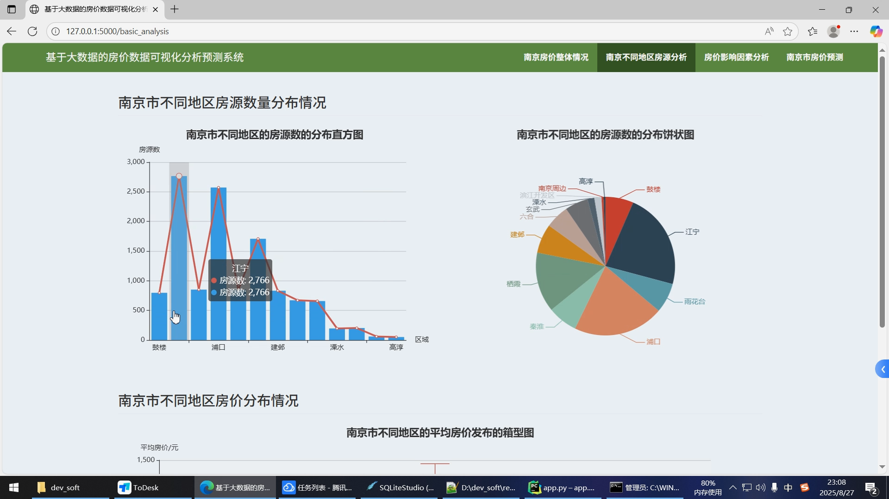

## 计算机毕业设计Python+决策树模型房价预测系统 房价可视化 房源推荐系统 大数据毕业设计(源码+LW+PPT+讲解+教程)

## 要求
### 源码有偿！一套(论文 PPT 源码+sql脚本+教程)

### 
### 加好友前帮忙start一下，并备注github有偿26房价预测
### 我的QQ号是1957722142 或者 2827724252或者798059319或者 1679232425
### 或者微信:biyesheji1698 或者 bysj2023nb


### 加qq好友说明（被部分 网友整得心力交瘁）：
    1.加好友务必按照格式备注
    2.避免浪费各自的时间！
    3.当“客服”不容易，repo 主是体面人，不爆粗，性格好，文明人。
## 介绍

```
利用网络爬虫从安居客抓取晋城市房源数据，并数据清洗、格式化，存储到关系数据库中。
从各地区房源数量、均价、房屋类型、产权年限等多角度对晋城市的房地产时间进行综合评估。
利用统计图标分析影响房价走势的主要因素，包括面积、建造时间、电梯配套设施等。
构建决策树算法模型，并利用现有房源的配置训练算法，实现用户自定义配置房源的价格预测。
```


## 运行视频
https://www.bilibili.com/video/BV1dqemzwEyh/

## 运行截图





